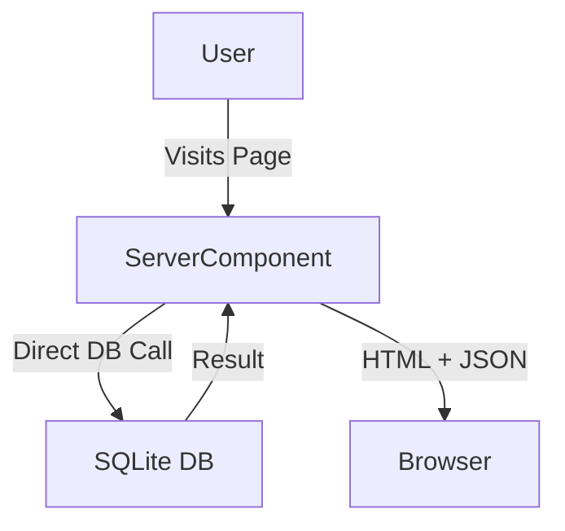

# Data Flow

## Client-Side Data Fetching
Data is primarily fetched in **Server Components** (Pages/Layouts) and passed down as props, or fetched on demand in Client Components.



## Interactive Actions (Mutations)
For actions like "Add to Cart" or "Update Profile":

```mermaid
graph TD
    Browser-->|API Request (POST/PUT)| API[Next.js API Route]
    API-->|Validate Session| Auth[Auth Logic]
    Auth-->|Valid| DB[SQLite DB]
    DB-->|Update Rows| DB
    API-->|JSON Response| Browser
    Browser-->|Update Zustand/State| UI[User Interface]
```

## File Upload Flow (Admin)
1.  **Admin** selects an MP3/WAV file.
2.  Browser creates `FormData`.
3.  `POST /api/admin/tracks` receives the stream.
4.  Server writes file to `public/uploads/audio/uuid-filename.mp3`.
5.  Server saves the **file path** (e.g., `/uploads/audio/...`) to the `tracks` table in SQLite.
6.  Success response returned.

## Payment Flow
1.  **User** clicks "Checkout".
2.  Client sends cart items to `/api/payment/create-order`.
3.  Server validates prices against DB (security check).
4.  Server talks to **Razorpay** to create an Order.
5.  Razorpay returns `order_id`.
6.  Client opens Razorpay Modal.
7.  User pays.
8.  Razorpay calls webhook/callback.
9.  Server verifies signature -> Updates DB -> Grants access.
